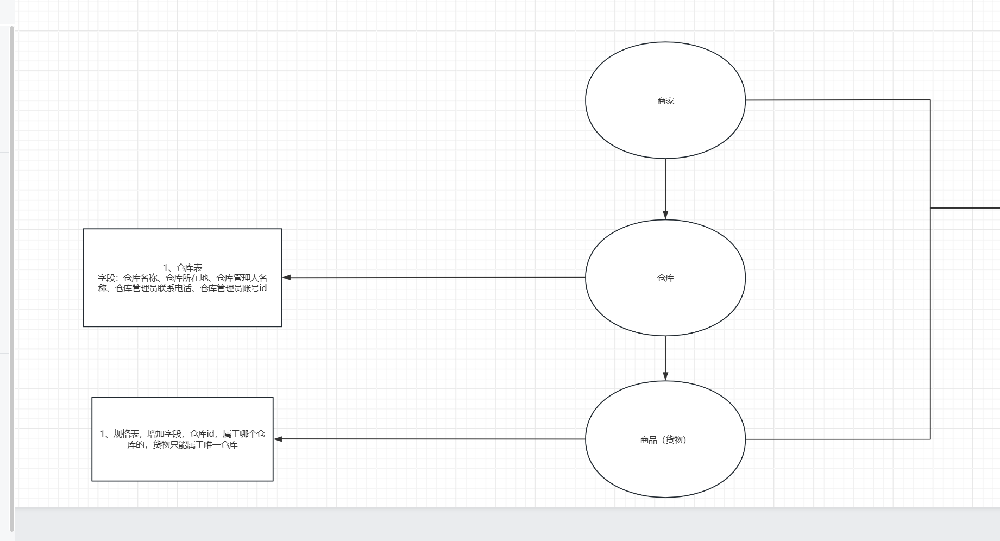

# seaFood 实战笔记

## 一、补充完整表

前言：原库主已经完成了商品表的创建



根据上图的描述可知，除了商品表，还有其他几个表，需要补全。

- warehouse 表：仓库表。一个商品有多个规格，每个规格存放在一个仓库中。
- merchant 表：商家表。商家和商品是多对多的关系吗？那中间是不是要有一个关联表，商家和仓库也是对多对呀？


## 二、批量修改商品规格的仓库

需求：当商品需要迁移时，批量将商品下的所有规格迁移到新的仓库中。

思考点：

- 1、前端会传什么参数过来？批量的商品id，和单个的仓库id。因此我们需要创建一个 `VO` 来保存这些数据。
- 2、编写这些方法，从 controller 层开始, 往下传递。

研发步骤：

1、创建 `ProductBatchEditVO` 存储：`productInfoIds` 和 `waveHouseId`

2、`ProductInfoController` 下创建 `batchEditWaveHouseByProductSpecification` 接收 `productBatchEditVO` 传递给 `ProductInfoServiceImpl` 进行业务处理。

3、在实现 `ProductInfoServiceImpl` 的业务时候，需要在接口层写这个接口。

4、接下来就是业务能力了。将vo的数据取出来，将 `ids` 进行转化，转化成商品的数据；获取商品下的全部规格，`setWarehouseId` 进去；最后批量操作设置商品规格表

```java
String productInfoIds = productBatchEditVO.getProductInfoIds();

String warehouseId = productBatchEditVO.getWarehouseId();

List<ProductInfo> productInfos = this.listByIds(Array.asList(productInfoIds.split(",")))

// 解决非法输入的情况。
List<String> productionIds = productInfos.stream().map(item -> item.getId()).collect(Collectors.toList());

List<ProductSpecification> productSpecifications = productSpecificationService.list(new LambdaQueryWrapper<ProductSpecification>().in(ProductSpecification::getProductId, productionIds))

for(ProductSpecification productSpecification : productSpecifications) {
   productSpecification.setWarehouseId(warehouseId); 
}

```

至此，我们差最后一步，就是批量修改商品规格表。

但是通过代码发现 `productSpecificationMapper` 并没有批量修改的方法。

上面的代码我偷了个懒，本应该使用 `productSpecificationMapper` 但是我提前使用了 `productSpecificationService`。

上面两句话什么意思呢？

就是本来 service 层应该使用 `productSpecificationMapper` 来操作数据库，但是由于 `productSpecificationMapper` 没有批量修改的方法，因此我直接使用 `productSpecificationService` 来操作数据库。

那为什么用 `productSpecificationService` 来操作？因为我知道 `jeecg` 框架的自动继承 `IService`，这里提供了 `updateBatchById` 用来批量修改数据的方法，只需要传入商品明细表的列表数据即可。

因此从上面来看，我们就可以补充最后一步批量修改商品规格表

```java
productSpecificationService.updateBatchById(productSpecifications);
return Result.ok("编辑成功");
```

但是我们在 `ProductInfoServiceImpl` 中引入 `productSpecificationService` 时发现，`productSpecificationService.deleteByMainId` 报错了。

说明 `productSpecificationMapper` 有提供 `deleteByMainId` 的方法，但是 `productSpecificationService` 没有。

但是有关系吗？没关系。因为 `Mapper` 有。

那我们就从 Mapper 层引上来。

```java
@Override
public boolean deleteByMainId(String mainId) {
   return productSpecificationMapper.deleteByMainId(mainId);
}
```