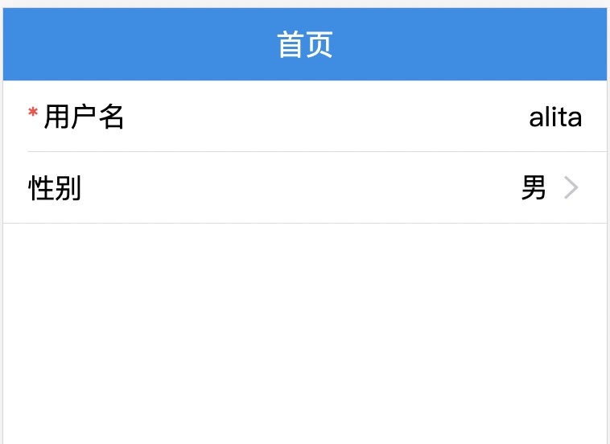
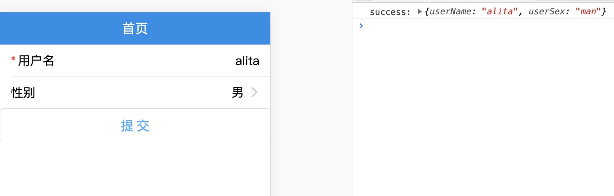
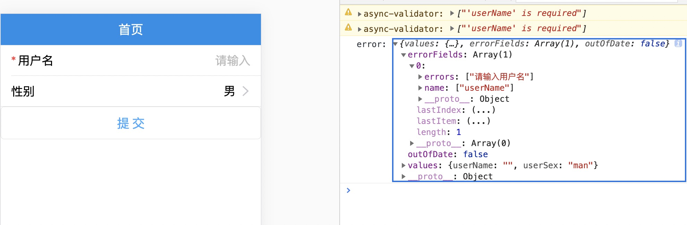
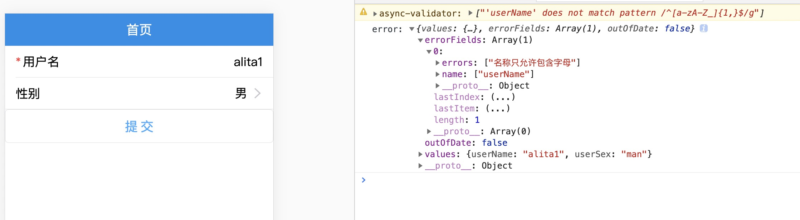
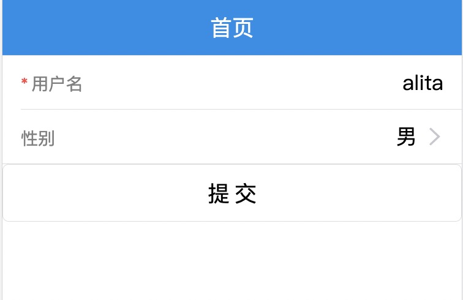
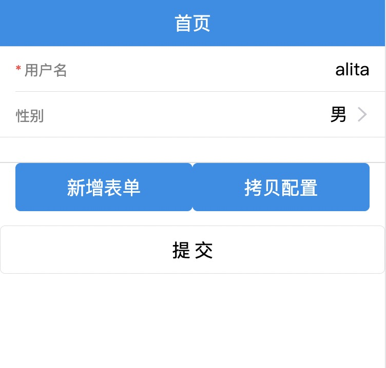

# dform 动态表单

## 引入

在终端上执行以下命令，引入 `@alitajs/dform` 动态表单的库

```bash
yarn run @alitajs/dform 

or 

npm i @alitajs/dform
```

## 表单展示

```js
import React, { FC } from 'react';
import DynamicForm, { IFormItemProps, useForm } from '@alitajs/dform';

const Page: FC = () => {
  const [form] = useForm();

  const data = [] as IFormItemProps[];

  const formProps = {
    form, // 表单定义
    data, // 数据源，表单全部字段
  };

   return (
     <div>
        <DynamicForm {...formProps} />
     </div>
   )
}

export default Page;
```

上面通过上面的代码，即可完成最简表单的编写，这时页面上还是空白，因为还未配置数据源，数据源以 `JSON` 的格式实现。我们试着增加一个 `input` 类型的表单，更多表单类型请看[dform 官网](https://dform.alitajs.com/)：

```js
const sexList = [ // picker 类型的数据源
  {
    label: '男',
    value: 'man',
  },
  {
    label: '女',
    value: 'woman',
  },
];

const data = [
  {
    type: 'input', // 字段类型
    fieldProps: 'userName', // 字段属性名
    placeholder: '请输入', 
    title: '用户名', // 标题
    required: true, // 是否为必填项
  },
  {
    type: 'picker',
    fieldProps: 'userSex',
    placeholder: '请选择',
    title: '性别',
    data: sexList,
  },
] as IFormItemProps[];
```

这时页面上会呈现如下样式：


每个字段的左侧红色的 `*` 代表该字段是否为必填项。

## 表单赋值回填

`<DynamicForm>` 有 `formsValues` 的属性，能够实现表单字段值的回填。

```diff
const formProps = {
  form, // 表单定义
  data, // 数据源，表单全部字段
+ formsValues: {
+   userName: 'alita',
+   userSex: 'man',
+ }
};
```



## 表单提交

`form` 字段有开放 `submit()` 方式，能够执行提交事件。

```diff
- import DynamicForm, { IFormItemProps, useForm } from '@alitajs/dform';
+ import DynamicForm, { IFormItemProps, Store, ValidateErrorEntity, useForm } from '@alitajs/dform';
+ import { Button } from 'antd-mobile';

...此处省略部分代码

+ const onFinish = (values: Store) => {
+   console.log('success:', values);
+ };

+ const onFinishFailed = (errorInfo: ValidateErrorEntity) => {
+   console.log('error:', errorInfo);
+ };

const formProps = {
  data: formsData,
  form,
  formsValues: {
    userName: 'alita',
    userSex: 'man',
  },
+ onFinish, // 表单提交成功事件
+ onFinishFailed, // 表单提交失败事件
};

return (
  <div>
    <DynamicForm {...formProps} />
+   <Button onClick={() => form.submit()}>提交</Button>
  </div>
)
```

点击 `提交` 按钮。在控制台能够看到提交成功的信息：



`input` 类型的 `用户名` 字段为必填项，如果我们删除用户名的数据点击 `提交` 按钮。



如果 `input` 类型需要增加正则校验，数据源里可增加 `rules` 规则。

```diff
const data = [
  {
    type: 'input', // 字段类型
    fieldProps: 'userName', // 字段属性名
    placeholder: '请输入', 
    title: '用户名', // 标题
    required: true, // 是否为必填项
+   rules: [
+     { required: true, message: `请输入` },
+     {
+       pattern: new RegExp(/^[a-zA-Z]{1,}$/, 'g'),
+       message: '名称只允许包含数字、字母和下划线',
+     },
+   ],
  },
  {
    type: 'picker',
    fieldProps: 'userSex',
    placeholder: '请选择',
    title: '性别',
    data: sexList,
  },
] as IFormItemProps[];
```

我们测试一下：



这里执行的是 `onFinishFailed` 表单提交失败的事件。

## 表单全局样式配置


`/config/config.ts` 文件下可增加 `theme` 字段，更过配置可查看[dform 官网-配置项](https://dform.alitajs.com/setting)：

```js
export default {
  appType: 'h5',
  mobileLayout: true,
  theme: {
    '@alita-dform-title-font-size': '0.28rem',
    '@alita-dform-title-color': 'gray',
  },
};
```



## 开发者模式

```diff
const formProps = {
  data: formsData,
  form,
  formsValues: {
    userName: 'alita',
    userSex: 'man',
  },
  onFinish, // 表单提交成功事件
  onFinishFailed, // 表单提交失败事件
+ isDev: true,
};
```



点击 `新增表单` 按钮，实现快速完成表单数据源的配置，`拷贝配置` 能够一键赋值数据源，拷贝到项目中。

教程请看 [@alitajs/dform 可视化开发者模式](https://v.qq.com/x/page/u3108c1l2o8.html);
