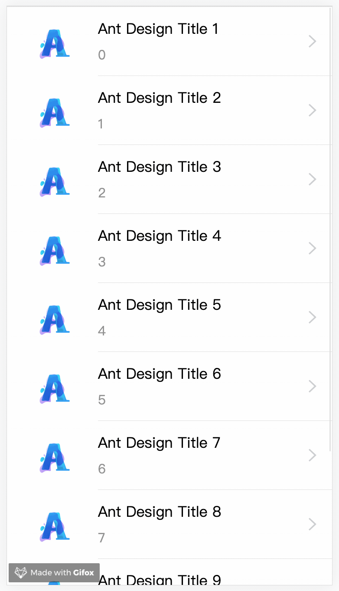
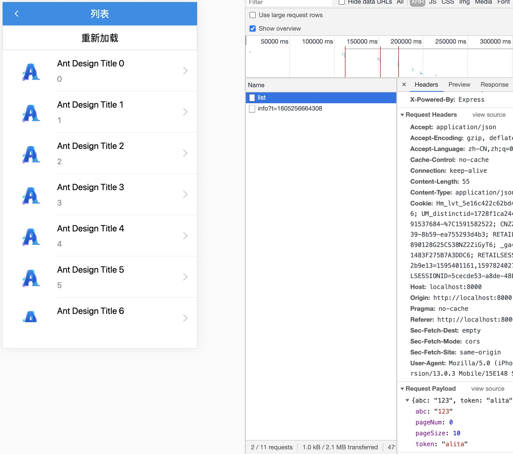
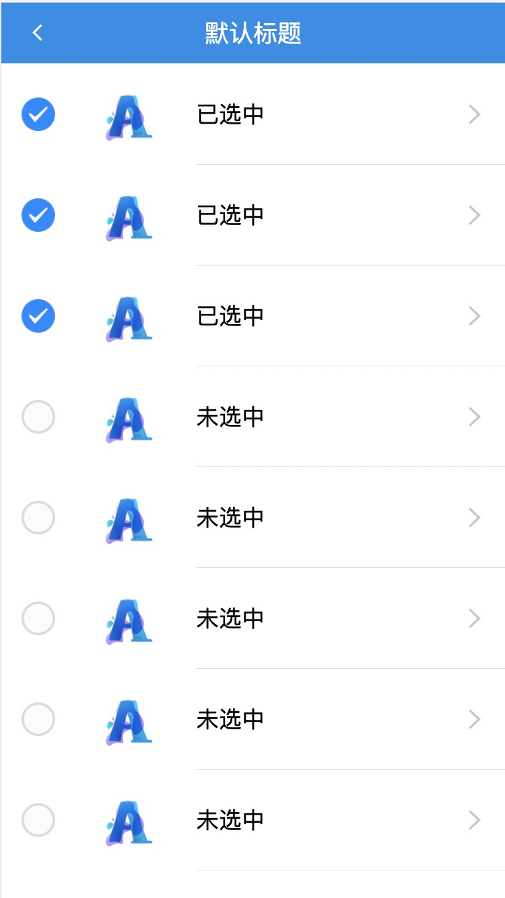

# @alitajs/list-view 自动加载更多列表

## 引入

```bash
yarn run @alitajs/list-view

or 

npm i @alitajs/list-view
```

## mock 数据编写

`/mock/app.ts`：

```js
import { Request, Response } from 'express';

export default {
  'POST /api/list': (req: Request, res: Response) => {
    const dataSource = Array.from(new Array(30)).map((item: any, ind: number) => ({
      id: ind,
      title: `Ant Design Title ${ind}`,
    }));
    const { body } = req;
    const { pageSize, offset } = body;

    return res.json({
      total: dataSource.length,
      data: dataSource.slice(offset, offset + pageSize),
    });
  },
};
```

## 分页加载

完整 api 可参考 [alita官网-listview api](https://alitajs.com/components/list-view#api)

`/src/pages/list/index.tsx`

```js
import React, { FC } from 'react';
import { List } from 'antd-mobile';
import { request } from 'alita';
import LoadMoreListView from '@alitajs/list-view';
import Logo from '@/assets/logo.png';

const { Item } = List;
const { Brief } = Item;

const Page: FC = () => {

  const renderRow = (rowData: any, sectionID: string | number, rowID: string | number) => (
    <Item arrow="horizontal" thumb={} multipleLine>
      {rowData.title} <Brief>{rowID}</Brief>
    </Item>
  );

  const queryList = (data: any): Promise<any> => {
    return request('/api/list', { data });
  };

  return (
    <LoadMoreListView
      isTabsPage // 是否是 tab 页面，若为 tab 页面，列表高度自动减少 tab 的高度
      requestFunc={queryList} // 发起异步请求
      renderRow={renderRow} // 项样式
      requestParams={{ 
        abc: '123',
        token: 'alita',
        pageSize: 10, // 每页数据长度
        offset: 0, // 初始分页数据
      }}
    />
  )
}

export default Page;
```



> 如果不需要下拉刷新的功能，可以设置 pullToRefresh={<></>}

## 外部刷新列表

```diff
- import React, { FC } from 'react';
+ import React, { FC, useRef } from 'react';
- import { List } from 'antd-mobile';
+ import { List, Button } from 'antd-mobile';
- import LoadMoreListView from '@alitajs/list-view';
+ import LoadMoreListView, { LoadMoreListAttributes } from '@alitajs/list-view';

const Page: FC = () => {

  return (
+   <Button
+     onClick={() => {
+       if (loadMoreList.current) loadMoreList.current.reloadDataSource();
+     }}
+   >
+     重新加载
+   </Button>
    <LoadMoreListView
+     ref={loadMoreList}
      ...
  )
}
```

这时滚动列表，点击 `重新加载` 的按钮，页面会重新请求接口。并且重置 `offset` 为 0。

## alias 别名替换

有时，接口请求的当前页数以及每页条数并非 `offset` 和 `pageSize`，这时我们尝试替换 `offset` 为 `pageNum`。

`LoadMoreListView` 支持 `alias` 字段替换别名

```diff
<LoadMoreListView
  ref={loadMoreList}
  isTabsPage
  requestFunc={queryList}
  renderRow={renderRow}
+ alias={{
+   offset: 'pageNum',
+ }}
  requestParams={{
    abc: '123',
    token: 'alita',
    pageSize: 10,
-   offset: 0,
+   pageNum: 0,
  }}
/>
```

同样的，`/mock/app.ts` 的参数也需要进行变更

```diff
- const { pageSize, offset } = body;
+ const { pageSize, pageNum } = body;

return res.json({
  total: dataSource.length,
- data: dataSource.slice(offset, offset + pageSize),
+ data: dataSource.slice(pageNum, pageNum + pageSize),
});
```

这时我们看下请求接口的入参：



## 购物车分页加载列表

购物车列表要能实现，选中、未选中、全选、获取选中数据等功能。

新建一个页面来实现。

代码量较多，所以分开写看着比较清楚。

#### 引入相关库

```js
import React, { FC, useState, useRef } from 'react';
import { List } from 'antd-mobile';
import { CartListAttributes, CartListView } from '@alitajs/list-view';
import { CartListModelState, ConnectProps, connect, request } from 'alita';
import styles from './index.less';

import Logo from '@/assets/logo.png';
import SelectIcon from '@/assets/select.png'; // 选中的图标，可自行增加在 /src/assets 文件夹下
import UnSelectIcon from '@/assets/unSelect.png'; // 未选中图标，可自行增加在 /src/assets 文件夹下

const { Item } = List;
```

#### 列表项样式

支持每一列表项数据源，是否选中标识，选中、取消选中事件。

```js
const row = (
  rowData: any,
  isSelected: boolean,
  selectItem: (key: any) => void,
  unSelectItem: (key: any) => void,
) => (
  <div
    style={{
      display: 'flex',
      alignItems: 'center',
    }}
  >
     {
        if (isSelected) {
          unSelectItem(rowData);
        } else {
          selectItem(rowData);
        }
      }}
    />
    <Item
      arrow="horizontal"
      thumb={}
      multipleLine
      style={{
        flex: '1',
      }}
    >
      {isSelected ? '已选中' : '未选中'}
    </Item>
  </div>
);
```

#### 异步请求

```js
const queryList = (data: any): Promise<any> => {
  return request('/api/list', { data });
};
```

#### 完整的串联(最简demo)

```js
const Page: FC<PageProps> = () => {
  const req = {
    abc: '123',
    token: 'alita',
    pageSize: 10,
    pageNum: 0,
  };

  return (
    <div className={styles.center}>
      <CartListView
        requestFunc={queryList}
        renderCartRow={row}
        requestParams={req}
        alias={{
          offset: 'pageNum',
        }}
      />
    </div>
  );
};
```



#### 全选

```diff
const Page: FC<PageProps> = () => {
  return (
    <>
+      <Button
+        onClick={() => {
+          if (cartList.current) cartList.current.toggleAll();
+        }}
+      >
+        全选
+      </Button>  
      <CartListView
+        ref={cartList}
        requestFunc={queryList}
        renderCartRow={row}
        requestParams={req}
        alias={{
          offset: 'pageNum',
        }}
      />
    </>
  )
}
```

#### 获取选中数据

```js
cartList.current.getSelectDate() 
```

#### cartlist api

| 方法             | 类型                | 说明             |
| ---------------- | ------------------- | ---------------- |
| toggleAll()      | () => void          | 全选/全不选      |
| getSelectAll()   | () => boolean       | 获取当前是否全选 |
| selectItem       | (item: any) => void | 设置选中项       |
| unSelectItem     | (item: any) => void | 设置非选中项     |
| getSelectDate    | () => any[]         | 获取选中数据     |
| getListData      | () => any[]         | 获取全部列表数据 |
| reloadDataSource | () => void          | 重新加载         |


