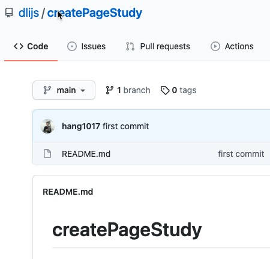
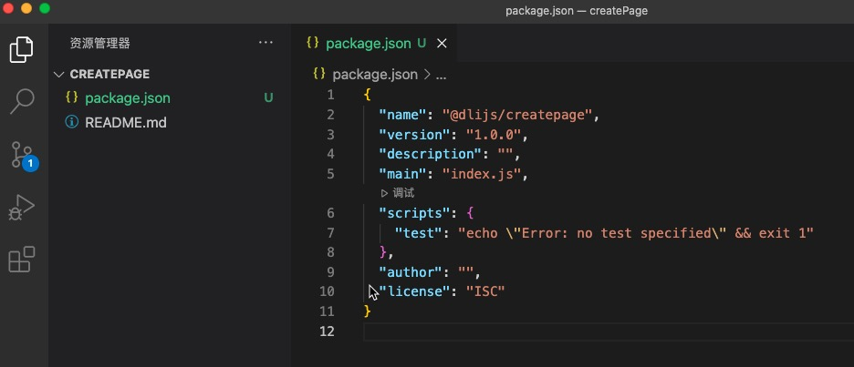
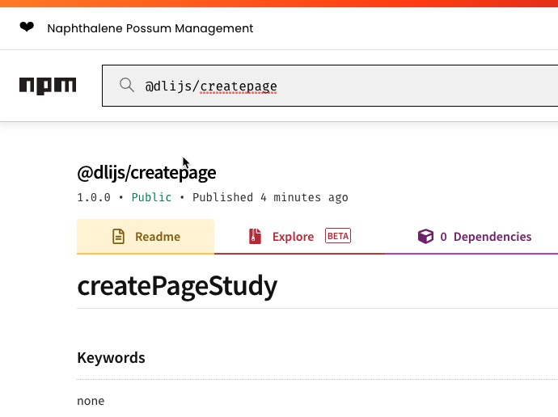
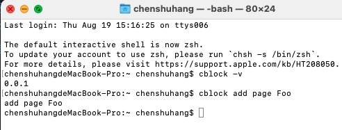
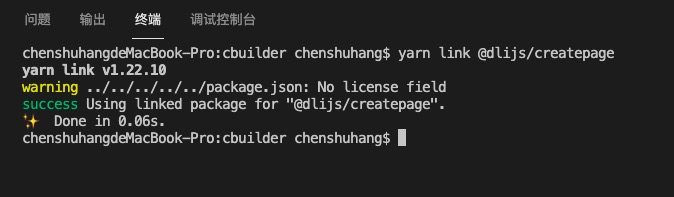
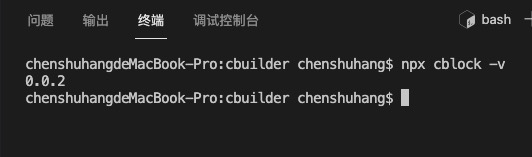
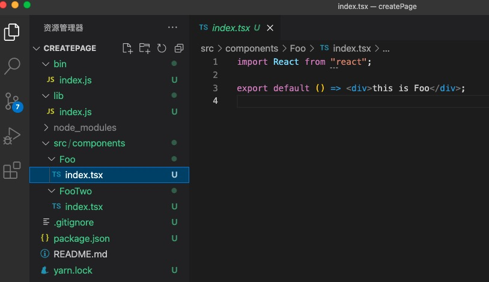
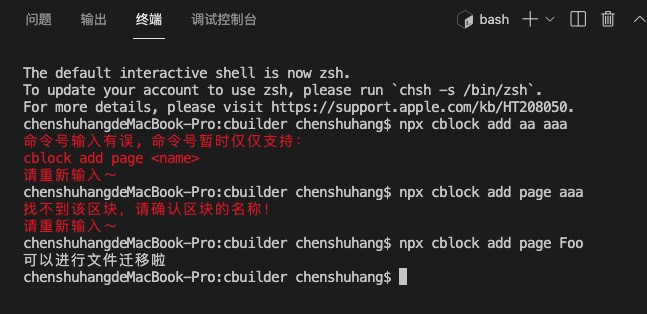
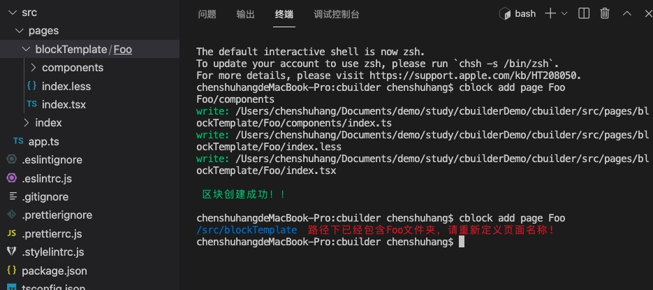

# 命令行创建模版页面教程

## 一、前言

在日常的业务开发中，我们经常会在不同的项目中，甚至是相同的项目中开发相似的页面。

那小伙伴的基本操作肯定是去翻找旧项目，然后 copy 代码过来改造(浪费时间)。

今天我们就来学习个项目，实现通过一行命令帮你在项目中创建特定的页面代码。

## 二、准备工作

**我们需要将项目推上 npm，才能实现该功能，所以没有 npm 账号的小伙伴提前去创建个 npm 账号。并给这个项目创建一个 git 仓库。**

创建一个 `git` 仓库



在仓库中执行 `npm init` 给项目一个初始化的 `package.json`。



并且在 `package.json` 文件上配上仓库的地址

```json
{
  ...

  "repository": {
    "url": "https://github.com/xxx/xxx.git"
  }
}
```

## 三、创建命令行

先给项目安装个依赖

```bash
yarn

or

npm
```

再增加一个 `.gitignore` 的文件

```
node_modules
* lock.json;
```

### 1、定义命令头部

首先自定义一个命令行。比如：

我希望通过 `-v` 能够看到该项目的版本号。

并且通过 `cblock add page pageName` 来实现创建文件。

那需要先定义 `cblock` 的名称。

给 `package.json` 增加一下代码：

```json
{
  "bin": {
    "cblock": "lib/index.js"
  }
}
```

即定义 `cblock` 的头部，当命令行头部为 `cblock` 的情况下，会默认走到 `lib/index.js` 的文件下。

### 2、创建文件入口

通过上面的文件路径，可以知道，我们需要在根目录下创建 `lib/index.js` 的文件。

```js
#!/usr/bin/env node

require("../bin/index");
```

很多小伙伴肯定好奇 `#!/usr/bin/env node` 这行代码是什么意思。

用于指明该脚本文件要使用 node 来执行。

`/usr/bin/env` 用来告诉用户到 path 目录下去寻找 node。

`#!/usr/bin/env node` 可以让系统动态的去查找 node，以解决不同机器不同用户设置不一致问题。

> 该命令必须放在第一行， 否者不会生效。

通过 `require("../bin/index");` 的代码也能知道我们还需要在跟目录下创建一个 `bin/index.js` 的文件。

### 3、实现 `-v` 查看版本号

这里我们需要先安装一个 `commander` 的库。 `yarn add commander`。

依赖安装完后我们来实现 `bin/index.js` 的代码

```js
#!/usr/bin/env node

const { program } = require("commander");

/**
 *  命令行解析
 */
const commanderAction = (command, type, name) => {
  console.log(command, type, name);
};

program
  .version("0.0.1", "-v --version -V")
  .arguments("<command> <type> <name>")
  .action(commanderAction)
  .parse(process.argv);

// 代码解析在下面
```

好了，编写完最简单的代码我们先发个 npm 包

> 这里要注意，`npm` 不能用淘宝源，要切换成 `npm 源`。

```bash
npm publish // 这行命令用来发布共有包

npm publish --access=public // 这行命令用来发布私有包
```

命令执行完，打开 [npm 官网](https://www.npmjs.com/)， 输入我们的包名，看看版本是否发布成功。通过下图可以确认的是我们已经成功发布了 npm 包。



### 4、测试 `-v` 命令

打开终端键入：

```bash
# 全局安装
yarn global add @dlijs/createpage

cblock -v

cblock add page Foo
```

我们能够获得下图的结果：



### 5、代码解析

首先我们打开 [commanderjs 官网](https://github.com/tj/commander.js/blob/master/Readme_zh-CN.md)

- `program` 为 `commander` 的全局对象。
- `version` 为设置版本，其默认选项为`-V` 和 `--version`，设置了版本后，命令行会输出当前的版本号。
- `arguments` 用来指定命令行的参数。
- `action` 执行命令的方法。输入完命令行后，键入回车键能执行 `action` 下的方法，并且能够将键入的命令行参数带出来。
- `.parse(process.argv)` 处理参数(理解未必正确)

## 四、建立本地测试环境

接下来我们要实现业务逻辑，就会需要不停的测试，不停的修正，那我们总不能每次测试都发一次 npm 版本，那样成本太大。所以我们需要建立本地的测试环境。

在我们 `createpage` 的根目录下键入命令行 `yarn link`。

功能就是可以进行本地的项目测试。

首先我们先创建一个 `alita` 或者是 `umi` 的测试项目。

安装完依赖后在的 `demo` 的根目录下按顺序键入：

```bash
# 这里的项目名称要修改成自己的项目
yarn add @dlijs/createpage

yarn link @dlijs/createpage
```

输入完成后你会看到以下的截图：



这时。我们去 `bin/index.js` 文件夹下修改 `version` 的版本号。

```js
program.version("0.0.2", "-v --version -V");
```

保存后，我们在 `demo` 下键入：

```bash
npx cblock -v
```



说明测试 demo 已经成功 `link` 上本地的项目了。现在我们只要修改完 `cblock` 项目就能马上得到验证。

## 五、校验命令行的正确性

那么现在我们就正式开始编写该项目的核心业务了。

在编写项目之前，我们可以先安装个 `colors-cli` 的库，能在控制台打印出有颜色的字，更醒目。

然后在项目的根目录下创建 `/src/components` 的文件夹，文件夹里随意创建两个简单的组件。



开发前，我们先思考下这块内容的逻辑。

首先要判断下命令行是否符合规范，如果不符合规范就没有再继续下去的必要了。直接结束，提示错误的信息即可。

其次要判断下用户输入的 `pageName` 是否有对应的组件名。如果有再进行 copy 操作。如果没有的话，就提示我们的项目下没有该组件，请修改 `pageName` 后重新输入命令。

首先我们对 `commanderAction` 的方法进行修改。

**代码中的自定义方法，会在下文中补充**

```js
/**
 *  命令行解析
 */
const commanderAction = (command, type, name) => {
  // 判断下命令行是否符合规范
  if (verifyCommand(command, type) === "page") {
    // 判断用户键入的 pageName 是否在项目的文件夹里
    if (checkNameExist(getComponents(), name)) {
      console.log("可以进行文件迁移啦");
    } else {
      // 如果不存在，直接走结束的方法
      exitNoExistName();
    }
  } else {
    // 不符合规范的命令行直接走结束的方法
    exitCommander();
  }
};
```

在 `/bin/index.js` 文件下编写两个方法：

```js
const color = require("colors-cli");

// 结束 commander
const exitCommander = () => {
  console.error(color.red("命令号输入有误, 命令号暂时仅仅支持： "));
  console.log(color.red("cblock add page <name>"));
  console.log(color.red("请重新输入～"));
  process.exit();
};

// 找不到区块而结束项目
const exitNoExistName = () => {
  console.log(color.red("找不到该区块，请确认区块的名称！"));
  console.log(color.red("请重新输入～"));
  process.exit();
};
```

`verifyCommand` 这个方法我们写到 `/bin/utils/index.js` 的文件夹下。

开始编写该方法前，我们先安装几个库：`fs`、`fs-extra`、`path`。

```js
const fs = require("fs");
const { readdirSync } = require("fs-extra");
const { join } = require("path");

module.exports = {
  // 判断下命令是否为 `add` 和 `page`。
  verifyCommand: (command, type) => {
    if (command === "add") {
      if (["page", "pages", "p"].indexOf(type) !== -1) {
        return "page";
      }
    }
    return "";
  },
  // 读取 /src/components 文件夹下的所有文件和文件夹的名称
  getComponents: (path = "../../src/components") => {
    return readdirSync(join(__dirname, path)).filter((pkg) => {
      return pkg.charAt(0) !== ".";
    });
  },
  // 判断用户输入的 pageName 是否在我们的项目中
  checkNameExist: (list = [], name) => {
    if (list.indexOf(name) !== -1) {
      return true;
    }
    return false;
  },
};
```

写完这些方法后，我们记得要去 `/bin/index.js` 的文件下引入这几个方法：

```js
const { verifyCommand, checkNameExist, getComponents } = require("./utils");
```

好了那么现在我们来测试下效果。



## 六、文件递归迁移

我们将要页面 copy 到 测试项目的 `/src/pages/blockTemplate` 的文件夹下(这里小伙伴们可以自行操作，只要能实现功能即可)。

实现功能前，我们先思考下这块的逻辑：

- 迁移代码之前我们需要先判断下 `/src/pages/blockTemplate` 目录下是否已经存在该组件了。如果已经存在了，就给出提示，结束操作。
- 先尝试复制该文件夹下的第一层文件。
- 实现了上面的步骤再思考如何递归复制文件。

`/bin/index.js`

```js
const createBlockFile = require("./createBlockFile");

/**
 *  命令行解析
 */
const commanderAction = (command, type, name) => {
  if (verifyCommand(command, type) === "page") {
    if (checkNameExist(getComponents(), name)) {
      createBlockFile(type, name);
    } else {}
    ....
    // 这里省略一部分代码
};
```

在 `/bin` 目录下新建一个 `createBlockFile.js` 的文件专门来处理文件递归复制的内容。

在实现 `createBlockFile.js` 还是继续在 `utils/index.js` 文件下实现判断组件是否存在：

```js
module.exports = {
  checkBlockExist: (name) => {
    let dirName = process.cwd(); //返回 Node.js 进程的当前工作目录
    const filePath = join(dirName, "src/pages", "blockTemplate");
    if (fs.existsSync(filePath)) {
      if (fs.existsSync(join(filePath, name))) {
        return false;
      }
      return true;
    } else {
      return true;
    }
  },
};
```

`/bin/createBlockFile.js`

```js
const color = require("colors-cli");
const { copy } = require("fs-extra");
const { join } = require("path");
const { checkBlockExist, getComponents } = require("./utils");

module.exports = function createBlockFile(type, name) {
  const flag = checkBlockExist(name);

  const copyFolder = (path) => {
    let dName = process.cwd();
    const currentPath = `../../src/components/${path}`; // 获取该组件的路径
    const fileList = getComponents(currentPath); // 获取该文件下的文件名
    fileList.forEach((item) => {
      // 这里判断是文件还是文件夹
      // 这个判断写的一般，有更好的方式小伙伴自行替换
      if (item.indexOf(".") !== -1) {
        const targetPath = join(__dirname, `../src/components/${path}`, item); // 组件库下的文件路径
        const createPath = join(
          dName,
          "src/pages",
          "blockTemplate",
          path,
          item
        ); // demo 项目下的文件路径
        console.log(color.green("write:"), createPath);
        copy(targetPath, createPath);
      } else {
        // 递归迁移代码
        copyFolder(`${path}/${item}`);
      }
    });
  };

  if (flag) {
    copyFolder(name);
    console.log("\n", color.green("区块创建成功！！"), "\n");
  } else {
    console.log(
      color.blue("/src/blockTemplate "),
      color.red(`路径下已经包含${name}文件夹，请重新定义页面名称!`)
    );
  }
};
```

直接把整套代码写上来是最简单的，部分代码都增加了标注，小伙伴可以一行行理解下。

话就不多说了，直接上截图看看效果。



[代码地址](https://github.com/dlijs/createPageStudy)
