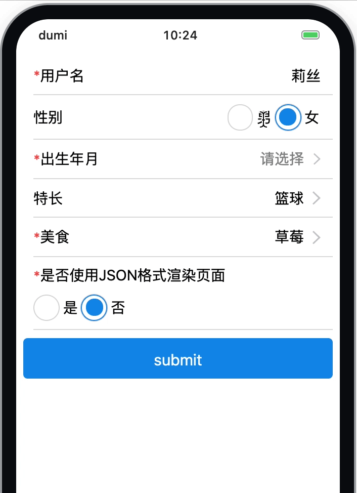
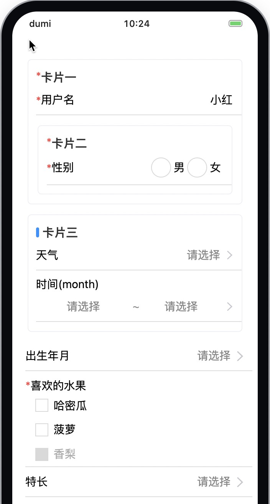

# 强大的移动端表单开发方案 @alitajs/dform

## 开发设想

从事移动端 H5 开发的小伙伴有没有经历过被长表单支配的恐惧？

是一个个表单项纯手写实现的吗？那一个页面你可能要做一天，心力憔悴。为什么表单实现这么难？

是使用 `antd-mobile` 的 `Form` 组件吗？那确实会让你提效 `50%`，但一个个设置 `Form.Item`，又感觉做了很多重复的动作。

如果表单中存在 `radio`, `check` 这类 `antd-mobile` 库里没有的样式，那我们还要自己实现 UI 吗？

再来一种情况，如果是后台提供的动态表单呢？心态崩了，还要自己遍历实现 UI，提交取值，回填赋值等需求。

那么能否有一种针对移动端长表单的快捷实现方案呢？

- UI 的快速实现
- 能实现一次性全部赋值
- 表单提交取值
- 融合多类型组件表单
- 支持动态表单

针对以上需求，我们开发 `@alitajs/dform` 支撑表单方案，并且在公司内部数十个项目中得到锤炼，不断优化完善。

## 基础使用

我们借鉴了 `antd@4` 的 `Form` 组件，针对表单使用的 `react-component/field-form` 库进行二次封装。不了解的小伙伴也没事。

想想表单需要哪些属性和事件？

- 表单全部字段
- 表单提交成功事件
- 表单提交失败事件
- 表单赋值回填的字段

```js
import React from "react";
import DynamicForm, { useForm } from "@alitajs/dform";
import { Button } from "antd-mobile";

const Page = () => {
  const [form] = useForm(); // 定义 form

  const onFinish = (values) => console.log("Success:", values);

  const onFinishFailed = (errorInfo) => console.log("Failed:", errorInfo);

  const formProps = {
    form, // 表单定义
    formsValues: {}, // 表单赋值回填数据
    onFinish, // 表单提交成功事件
    onFinishFailed, // 表单提交失败事件
  };

  return (
    <>
      <DynamicForm {...formProps}>
        <DformInput fieldProps="username" required clear title="用户名" />
      </DynamicForm>
      <Button
        onClick={() => {
          form.submit();
        }}
      >
        Submit
      </Button>
    </>
  );
};

export default Page;
```

这个最简 demo 里核心代码应该就 `12` 行。

`dform` 共提供 `14` 种组件。涵盖：

- 文本展示及输入类型: `DformInput` 和 `DformTextArea`
- 选择类型: `DformPicker` 和 `DformSelect`
- 多选类型: `MultiplePicker`
- 开关类型: `DformSwitch`
- 时间选择类型: `DformDatePicker`
- 图片选择类型: `DformImagePicker`
- 选择地址类型: `AddressPicker`
- Radio 按钮类型: `DformRadio`
- Check 多选类型: `DformCheckBox`
- 高阶输入类型: `ExtraInput`
- 文件上传类型: `DformFile`

如果这么多的组件还不能满足需求，不着急。我们还提供 自定义类型: `DformCustom` 组件，让用户自己实现，并在文档中提供教程。或者给我们提个 [issues](https://github.com/alitajs/DynamicForm/issues)，我们会根据评估结果进行开发和维护。

## 提效点

### 级联

开发过复杂表单的小伙伴一定有过级联的需求，对于字段固定的表单，可以通过自定义某个组件的 `onChange` 方法，自行触发其他组件的配置。

如果是动态表单，就比较让人头疼。

对此，我们给 `dform` 增加了 `relatives` 属性。用于配置整个表单的全部级联关系。

四种级联规则包括：

- 修改表单任意组件的值
- 调整表单任意组件是否为必填项
- 调整表单任意组件是否隐藏
- 调整表单任意组件是否不可编辑

有了可配置的级联规则，我们就可以从 `onChange` 的方法中解放出来。提高复杂表单的开发逻辑效率。

```javascript
const relatives = {
  sex: [
    {
      type: "changeFormValue", // 修改值
      targetValue: ["woman"], // 当 sex 组件选中 `woman`
      targetSet: [
        {
          targetField: "username", // `username` 这个组件值修改为 `莉丝`
          targetValue: "莉丝",
        },
      ],
    },
    {
      type: "required", // 是否必填
      targetValue: ["woman"], // 当 sex 组件选中 `woman`
      targetSet: [
        {
          targetField: "date", // date 组件为必填
        },
      ],
    },
    ...
  ],
  ...
};
```



### 分组

很多表单并不会以长表单的方式，直接展示在界面上，而是根据模块划分，比如个人信息、家庭信息、业务信息等。

表单存放在各个模块中，小伙伴们没必要在一个页面上定义多个表单，但是分块后又难以实现样式和单个表单的统一处理。

对此我们使用 `const { Group } = DynamicForm` 导出分组的组件。助力小伙伴自动实现卡片样式。



```javascript
<DynamicForm {...formProps}>
  <Group type="card" title="卡片一" required>
    <DformInput
      fieldProps="username"
      required
      placeholder="请输入"
      title="用户名"
      defaultValue="小红"
    />
    <Group type="card" title="卡片二" required>
      <DformRadio fieldProps="sex" title="性别" required data={sexData} />
    </Group>
  </Group>
  ...
</DynamicForm>
```

### 一行代码配置样式

不同的项目，不同的 ui 设计师，针对表单的开发样式肯定不一样，比如：

- 标题的颜色和大小
- 值的颜色和大小
- placeholder 颜色
- ...

在 `.umirc.ts` 和 `config.ts` 下配置：`theme`

| 参数                            | 说明                                                             | 默认值    |
| ------------------------------- | ---------------------------------------------------------------- | --------- |
| `@alita-dform-title-font-size`  | 标题大小                                                         | `28px`    |
| `@alita-dform-title-color`      | 标题颜色                                                         | `#000`    |
| `@alita-dform-value-font-size`  | 选中项和输入框的值大小                                           | `28px`    |
| `@alita-dform-value-color`      | 选中项和输入框的值颜色                                           | `#000`    |
| `@alita-dform-placeholder`      | `placeholder` 的颜色                                             | `#888`    |
| `@color-text-disabled`          | 不可编辑的文字颜色                                               | `#000`    |
| `@alita-dform-radio-color`      | CoverRadio, Radio, CheckBox, MultiplePicker 选中时的颜色         | `#1677ff` |
| `@alita-dform-radio-font-color` | CoverRadio, Radio, CheckBox, MultiplePicker 选中时的文字颜色颜色 | `#fff`    |
| `@alita-dform-padding`          | 表单项间距                                                       | `24px 0`  |

### 单独使用

组件除了嵌入表单以外，还支持单独使用的效果。

```ts
const Page: FC = () => {
  const [inputValue, setInputValue] = useState<string>("1");
  return (
    <>
      <DformInput fieldProps="a" placeholder="请输入" title="用户名" defaultValue={inputValue} />
      <WhiteSpace size="sm" />
      <Button type="primary" onClick={() => console.log({ inputValue })}>
        Submit
      </Button>
    </>
  );
};
```

当然单独使用的组件很可能被灵活的放在任何位置，所以当组件被包裹在`DynamicForm` 中，却又希望被单独使用时，`dform` 支持通过设置 `formFlag={false}` 来实现此能力。

## 支撑公司重点项目

- 灵犀低代码平台
- 湖南电信采购平台
- 新销售平台
- 火麒麟政企平台
- 福建销售中心
- 辽宁政企
  ...

## 结束语

`dform` 的表单之路还在延续，欢迎小伙伴们能够提供更好的想法。

欢迎给我们提供 `pr` 或者 `issues`。

官网文档：https://dform.alitajs.com/

GitHub: https://github.com/alitajs/DynamicForm
