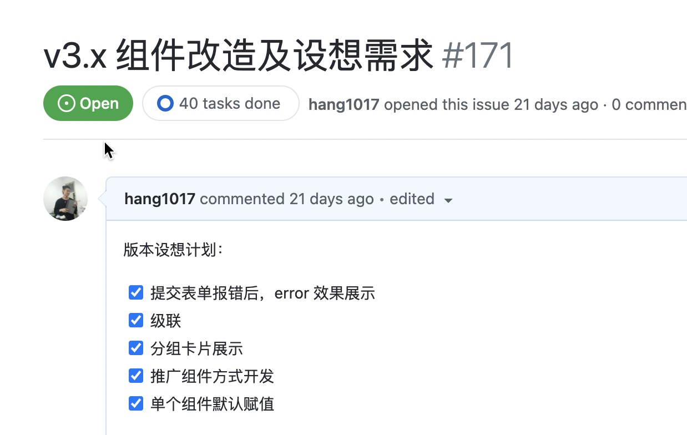
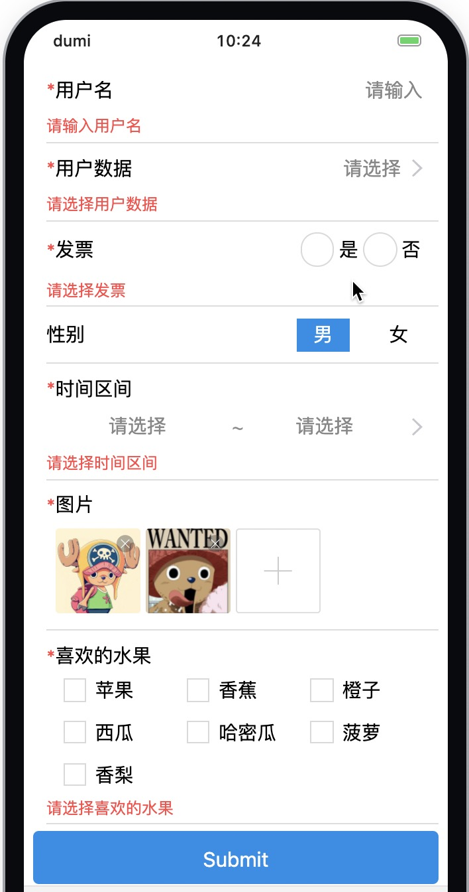

# @alitajs/dform 移动端表单库 3.0 强势来袭

## 一、回顾 2.0

### 前言

为了解决从事移动端 h5 开发的小伙伴被长表单支配的恐惧，我们在 `2020` 年年初推出了 `dform` 的第一个版本。

经过一年多的时间的沉淀，在公司内部数十个项目中得到锤炼，不断的完善优化。升级了稳定的 `2.0` 版本。

### 基础功能介绍

我们借鉴 `antd@4` 的 `Form` 组件，对底层表单库进行二次封装。

补充了 `radio 单选`、`checkbox 多选`、`rangeDatePicker 时间区间选择器` 等 `antd-mobile` 库里没有的组件样式。

实现一行代码实现单页面表单的取值赋值操作。

做到一行配置代码统一修改整个项目的表单样式，在多人协同开发项目的情况下保证表单样式的统一。

可视化 `isDev` 开发者模式方案。[@alitajs/dform 可视化开发者模式](https://v.qq.com/x/page/u3108c1l2o8.html)

方案涵盖：

- UI 的快速实现
- 能实现一次性全部赋值
- 表单一次性提交取值
- 融合多类型组件表单
- 支持动态表单
- 一行代码配置项目表单样式

## 二、强大的新功能

经过数十个项目的积累，我们收集到了来自小伙伴们的新需求。至此 `dform3` 的新功能设想慢慢变得清晰：



### 1、表单提交报错时的错误提示

我们将 `antd-mobile` 的 `List` 组件从 `dform` 中抽离出来，提高了表单样式的灵活性。

并在每次执行 `submit()` 的提交表单数据方法时获取错误信息，展示在页面上。



### 2、级联

开发过复杂表单的小伙伴一定有过级联的需求，对于字段固定的表单，可以通过自定义某个组件的 `onChange` 方法，自行触发其他组件的配置。

如果是动态表单，就比较让人头疼。

对此，我们给 `dform` 增加了 `relatives` 属性。用于配置整个表单的全部级联关系。

四种级联规则包括：

- 修改表单任意组件的值
- 调整表单任意组件是否为必填项
- 调整表单任意组件是否隐藏
- 调整表单任意组件是否不可编辑

有了可配置的级联规则，我们就可以从 `onChange` 的方法中解放出来。提高复杂表单的开发逻辑效率。

```js
const relatives = {
  sex: [
    {
      type: "changeFormValue", // 修改值
      targetValue: ["woman"], // 当 sex 组件选中 `woman`
      targetSet: [
        {
          targetField: "username", // `username` 这个组件值修改为 `莉丝`
          targetValue: "莉丝",
        },
      ],
    },
    {
      type: "required", // 是否必填
      targetValue: ["woman"], // 当 sex 组件选中 `woman`
      targetSet: [
        {
          targetField: "date", // date 组件为必填
        },
      ],
    },
    ...
  ],
  ...
};
```

来看下效果图：


## 3、分组

很多表单并不会以长表单的方式，直接展示在界面上，而是根据模块划分，比如个人信息、家庭信息、业务信息等。

表单存放在各个模块中，小伙伴们没必要在一个页面上定义多个表单，但是分块后又难以实现样式和单个表单的统一处理。

对此我们使用 `const { Group } = DynamicForm` 导出分组的组件。助力小伙伴自动实现卡片样式。


代码的实现方式更是方便，还能支持多层卡片嵌套：

```js
<DynamicForm {...formProps}>
  <Group type="card" title="卡片一" required>
    <DformInput
      fieldProps="username"
      required
      placeholder="请输入"
      title="用户名"
      defaultValue="小红"
    />
    <Group type="card" title="卡片二" required>
      <DformRadio fieldProps="sex" title="性别" required data={sexData} />
    </Group>
  </Group>
  ...
</DynamicForm>
```

如果是以 `json` 的形式实现 `dform` 我们也提供多层卡片嵌套的能力：

```js
const data = [
  {
    type: "group",
    fieldProps: "group1",
    groupProps: {
      type: "card",
      title: "卡片一",
      required: true,
    },
    children: [
      {
        type: "input",
        fieldProps: "username",
        required: true,
        placeholder: "请输入",
        title: "用户名",
        defaultValue: "小红",
      },
      {
        type: "group",
        fieldProps: "group2",
        groupProps: {
          type: "card",
          title: "卡片二",
          required: true,
        },
        children: [
          {
            type: "radio",
            fieldProps: "sex",
            title: "性别",
            data: sexData,
            required: true,
          },
        ],
      },
    ],
  },

  ...

];
```

### 4、推广组件化方式开发

在 `2.0` 的版本中，我们主要推广 `json` 的方式类似实现动态表单，但是在实际的业务开发中，我们能够发现，很多场景下会在表单内增加很多自定义的样式。

所以表单并不一定是一行行顺序展示下来，很可能中间会嵌入自定义的样式，这里如果还是用 `json` 的开发形式，就带来了极大的不便利。

所以我们强烈建议从 `@alitajs/dform` 里导出各个组件来实现业务。

组件化开发和 `json` 开发的代码量和 `api` 都保持一致。

### 5、单个组件默认赋值

除了在 `formsValues` 赋值，还在每个组件下增加了 `defaultValue` 的默认值。

`formsValues` 的赋值权限大于 `defaultValue`。及如果两处都有赋值的情况下，将优先使用 `formsValues` 的值。

## 仓库维护人员

- 陈小聪: https://github.com/xiaohuoni
- 薛诗东雨: https://github.com/DIYCCC
- 陈书航: https://github.com/hang1017
- 林君源: https://github.com/Dreamljy

---

- `171` 次提交
- `9,598` 行代码
- `10` 个工作日的深夜

本次 `dform@3` 的内容，通过小伙伴们的共同努力，在最短的时间完成预定的所有需求，在此特别鸣谢他们对本次任务顺利完成的付出。

## 结束语

`v3.0` 的版本并不是结束，`dform` 的表单之路还在延续，欢迎小伙伴们能够提供更好的想法。

欢迎给我们提供 `pr` 或者 `issues`。

官网文档：https://dform.alitajs.com/

GitHub: https://github.com/alitajs/DynamicForm

欢迎进入官网文档左上角给 `dform` 一个 `star`。给作者一点支持和动力。
