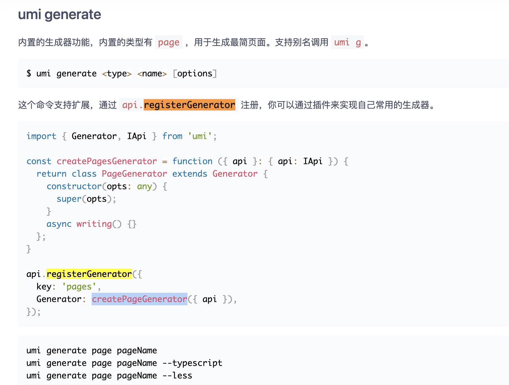
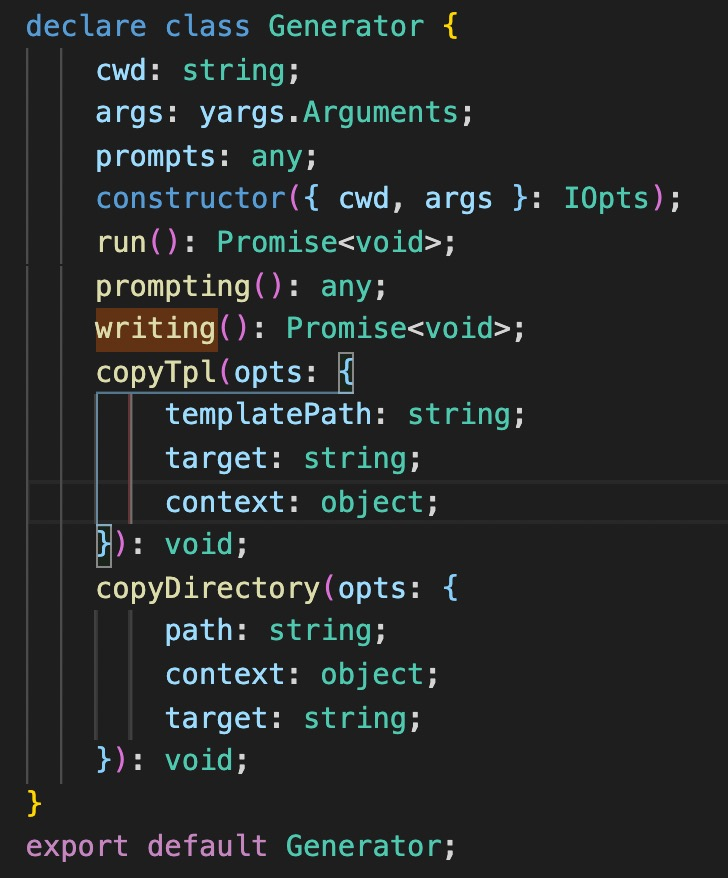

# 阅读 registerGenerator UMI 插件

## 一、前言

在使用 UMI 插件开发命令行功能时，需要使用 `registerGenerator` 这个 API。[UMI 官网](https://umijs.org/zh-CN/docs/cli#umi-generate) 对此做了介绍。

在 [`umi-next`](https://github.com/umijs/umi-next) 里，发现对 `registerGenerator` 进行了升级，使用起来更加简洁明了。

那么就来熟悉下 `registerGenerator` 的前后使用差异。

## 二、umi3 下的 registerGenerator



`registerGenerator` 开放两个属性：

- key: 命令行关键字。
- Generator: 自定义的功能实现。

在命令行中键入 `umi generate <type> <name> [options]`。会通过监听对应的 `key` 执行 `Generator` 下的内容。

以下是 `Generator` 内置提供的方法



有了这些方法，能够异步写入模板、写入文件夹、执行提示等操作。

例如想要在业务项目的某个位置创建页面，或者是创建一整个项目，可以通过以下代码来实现：

```js
async writing() {
  this.copyTpl({
    templatePath: join(__dirname, 'model.ts.tpl'),
    target: join(api.paths.absSrcPath!, 'pages', `file.js`),
    'this is content',
  });

  this.copyDirectory({
    path: join(__dirname, dirPath),
    target: join(this.cwd, this.appName),
  });
}
```

## 三、umi-next 下的 registerGenerator

### 1、使用能力

将 `Generator` 替换成以下属性：

- name: 在执行命令行时显示的功能名称
- description: 对功能的详细描述
- type: 1)、`enable` 在执行命令前会先调用 `checkEnable` 方法来校验是否满足自定义的环境，若不满足会结束命令，并给出错误提示。2)、`generate` 直接生成
- checkEnable: `type` 为 `enable` 时需声明，用来检查是否开启
- fn: 执行命令行的功能，并开放出 `api`、`generateFile`、`installDeps`、`updatePackageJSON` 等辅助功能和属性让提高用户体验。

开发者和用户在使用上述的 API 时会对功能描述更加清晰，`fn: () => {}` 开放出来的辅助函数更加便捷。来看以下例子：

```js
fn: async (options) => {
  const { args, api, generateFile } = options;

  // 复制文件或目录
  generateFile({
    path: join(__dirname, "../../templates/generate/page"),
    target: join(api.paths.absPagesPath, name),
    data: {
      ...这里可传入模版替换字,
    },
  });

  // 安装依赖
  installDeps({
    cwd: "相对路径",
    opts: {
      dependencies: ["umi", "react-dom"],
      devDependencies: ["chalk"],
    },
  });

  // 更新 package.json
  // 获取某个路径下的 pkg 文件。增加要修改的内容在 opts 上。
  updatePackageJSON({
    cwd: "../umi",
    opts: {
      scripts: {
        dev: "umi dev",
      },
    },
  });
};
```

### 2、两者的比较

升级后的 `registerGenerator` 增加了命令行执行前的检测能力，减少了误执行命令带来的风险。

`fn` 的函数内置了重复的代码，使代码更加轻便，让开发者集中精力在功能代码上。针对重点功能抛出了辅助函数.

拿 `generateFile` 来说，原有的逻辑需要开发者自行判断路径的类型，`copy` 的功能分为 `copyTpl` 和 `copyDirectory`。而 `generateFile` 对其进行整合，内置了路径类型判断和 `copy` 功能。

接下来，就抽丝剥茧般的阅读下这块代码。

### 3、`Generator` 底层逻辑

在 `/core/src/service/pluginApi.ts#L81` 中得知，最终所执行的是 `Generator` 类，并将全部参数传递过去。通过 `this.service.generators[key] = new Generator()` 保证了每个命令行互不影响，允许多条命令同时执行。

继续点击 `Generator` 进入到 `generator.ts` 文件，在这个文件下看到了 `registerGenerator` 的所有类型定义。

`registerGenerator` 能力的使用，是因为执行了 `umi generate xxx`(简写 `umi g xxx`)。

命令的建立在 `umi` 里是使用 `registerCommand`，所以可以通过全局搜索 `name: 'generate'` 的代码位置。

不出意外，我们能在 `/core/src/service/generatePlugin.ts` 下找到其核心逻辑。

从代码中能够看到 `type === enable` 会异步进行 `checkEnable` 的校验，若为 `generate` 则直接执行。并且在 `fn()` 函数中抛出了 `generateFile`、`installDeps`、`updatePackageJSON` 等函数和属性。

`Generator` 至此告一段落。

### 4、`generateFile` 底层逻辑

从两个 `umi` 版本中可以看出大部分使用 `registerGenerator` 的场景都在使用 `copy` 能力。因此，`generateFile` 算是核心逻辑。

在 `packages/utils/src/BaseGenerator` 就是整个页面生成器的核心。

`./BaseGenerator.ts` 下对 `path` 参数做了两层判断。

如果是文件夹类型，则使用 `copyDirectory` 进行文件夹的复制。

如果文件后缀为 `.tpl` 则使用 `copyTpl` 实现模版复制。

剩余内容则通过文件拷贝的功能用 `fs.copyFileSync(path, absTarget)` 来实现。
