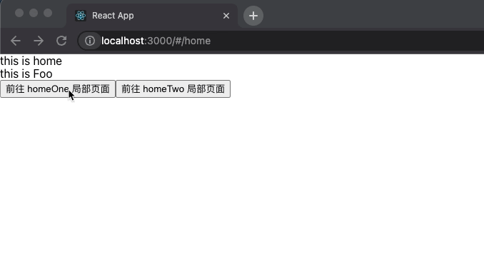

# React-Router v6 使用教学

## 前言

React-Router V6 出版一段时间，前端的小伙伴们也开始向着 v6 版本进行升级。v5 和 v6 的版本 api 有些差异。

对此写一篇文档整理了下 v6 的使用教学，文章已实际使用为主。

进入正题：

## 一、Route

`Route` 的使用变得更加简洁，可读性更高。

```js
import { HashRouter, Route, Routes } from "react-router-dom";

<HashRouter>
  <Routes>
    <Route path="/" element={<Index />} />
    <Route path="/home" element={<Home />} />
    <Route path="/user:userId" element={<User />} />
  </Routes>
</HashRouter>;
```

## 二、页面跳转

### 1、Link 跳转

```js
import { Link } from "react-router-dom";

export default Page = () => {
  return (
    <>
      <div>
        <Link to="home">to home page</Link>
      </div>
      // 跳转页面进行替换路由
      <div>
        <Link replace to="home">
          to home page
        </Link>
      </div>
      // 用户可以在这里自定义 userId
      <div>
        <Link to="user:123">to user page</Link>
      </div>
    </>
  );
};
```

### 2、方法跳转

这里介绍用户常用的跳转方式，第二个入参可选的配置参数。

```js
import { useNavigate } from "react-router-dom";

export default Page = () => {
  let navigate = useNavigate();
  return (
    <>
      <button onClick={() => navigate("/home")}>跳转到 home 页面</button>
      <button onClick={() => navigate("/home", { replace: true, state: {} })}>替换到 home 页面</button>
    </>
  );
};
```

- `replace`: 用户配置是否是替换路由，而非创建路由。
- `state`: 用户参数传递，但是这些参数并不会在 url 上体现。而是存在了 `state` 里，这就要保证用户必须是从某个页面跳转过来，并且 `state` 有配置参数。如果用户是直接访问该链接，那么就无法拿到 `state` 里的数据。

如果需要回退页面的话，使用 `navigate(-1)` 即可。

## 三、urlSearchParams 实现路由参数拼接

在 `umi` 或者 `alita` 项目中，可以使用 `locaiton.query` 或者链接上的参数，并整合成对象。而新的 `router` 不再提供这种能力的支持。

推荐使用 [URLSearchParams](https://developer.mozilla.org/en-US/docs/Web/API/URLSearchParams)

项目中引入 `url-search-params-polyfill`。

```bash
yarn add url-search-params-polyfill
```

在全局里引入 `url-search-params-polyfill`:

`/src/index.ts`: `import 'url-search-params-polyfill';`

使用方式如下：

```js
let searchParams = new URLSearchParams({ name: "hang" });
searchParams.append("age", "18");
navigate(`/home?${searchParams.toString()}`);
```

将对象转化成 url 拼接的形式，拼接在跳转链接后，通过 `navigate` 实现跳转。

跳转后，在目标页面上获取对应的数据：

```js
let location = useLocation();
let urlParams = new URLSearchParams(location.search);
const obj = {} as any;
urlParams.forEach((value, key) => (obj[key] = value));
```

或者可以写一个工具方法来实现：

```js
import qs from "qs";

const useQueryUrl = (props) => {
  const { location, match } = props;
  const { search } = location;

  const matchParams = match?.params || {};

  return {
    matchParams,
    searchParams: qs.parse(search, { ignoreQueryPrefix: true }),
  };
};

export default useQueryUrl;
```

## 四、嵌套路由



这就是需求实现的效果。

要实现局部路由的效果，首先 `<Route>` 需要实现嵌套。

```js
<Routes>
  <Route path="/" element={<Index />} />
  <Route path="/home" element={<Home />}>
    <Route path="/home/one" element={<HomeOne />} />
    <Route path="/home/two" element={<HomeTwo />} />
  </Route>
  <Route path="/user:userId" element={<User />} />
</Routes>
```

嵌套的路由通过 `<Outlet />` 展示。

所以在 `/home` 文件下用 `<Outlet />` 代替 `<HomeOne />`、`<HomeTwo />` 的展示。

```js
import React from "react";
import { useLocation, Outlet, useNavigate } from "react-router-dom";

const HomePage = (props) => {
  let location = useLocation();
  let navigate = useNavigate();
  let urlParams = new URLSearchParams(location.search);
  const obj = {} as any;
  urlParams.forEach((value, key) => (obj[key] = value));

  return (
    <div>
      this is home
      <button onClick={() => navigate("/home/one")}>前往 homeOne 局部页面</button>
      <button onClick={() => navigate("/home/two")}>前往 homeTwo 局部页面</button>
      <Outlet />
    </div>
  );
};

export default HomePage;
```

## 五、自定义 id

在跳转页面时若需要带上自定义的 id，我们需要从定义开始重新配置，但是实现流程非常简单。

定义路由：

```js
<Route path="/user:userId" element={<User />} />
```

页面跳转：

```js
<Link to="user:123">to user page</Link>

// or：

<button onClick={() => navigate("/user:111")}>跳转到 user 页面</button>
```

在目标页面获取自定义 id

```js
import React from "react";
import { useParams } from "react-router-dom";

const UserPage = () => {
  let { userId } = useParams();
  return <div>this is user, userId is: {userId}</div>;
};

export default UserPage;
```

以上就是我整理的较为常用的路由操作，本文重在实际操作，理论依据或者需要完整的 api 请小伙伴们参考[React Router v6 迁移指南](https://reactrouter.com/docs/en/v6/api)

[代码地址](https://github.com/hang1017/react-router-6-demo.git)
